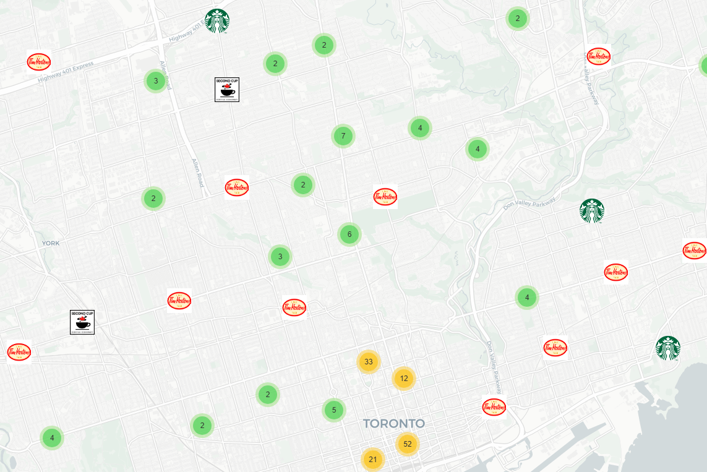
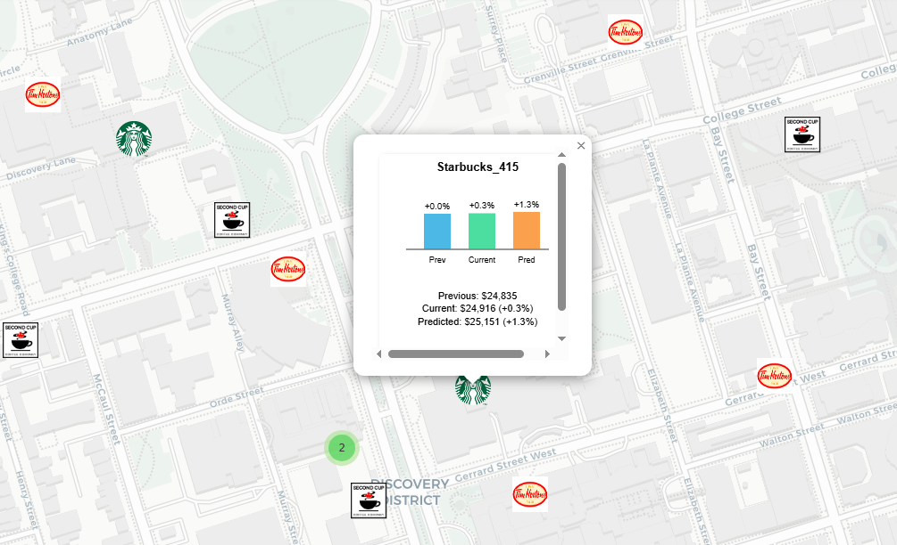
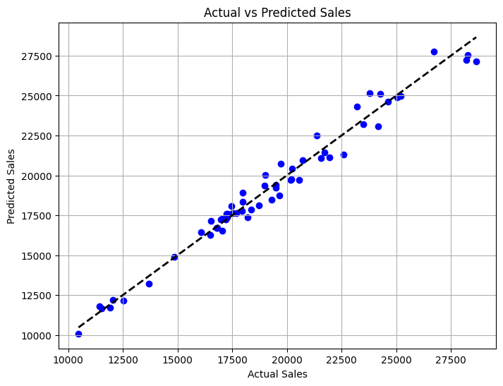

# ai-starbucks-sales-prediction-map

## Overview
This project combines **machine learning**, **GIS**, and **Python visualization** to predict Starbucks store sales across Toronto, Canada.  
It integrates **Random Forest regression modeling** with **interactive geospatial mapping** to provide spatial insights into the coffee retail market.

---

## Project Goals
- Predict **next month's Starbucks store sales** using historical data and store attributes.
- Visualize **Tim Hortons**, **Second Cup**, and **Starbucks** locations across Toronto on an interactive map.
- Represent **Starbucks sales** at each location using dynamic **bar charts** (previous, current, and predicted sales).

---

## Key Features
- **Random Forest Regression Model** trained with over 20 variables, achieving **R² score of 98%** on test data.
- **Interactive Toronto map** created using **Folium** and **Marker Clustering**.
- **Custom bar graphs** embedded in the map for Starbucks stores.
- Geospatial features engineered: store density, distance to downtown, competition within 250m radius, and more.

---

## Technical Stack
- Python (Pandas, Scikit-learn, Folium, Matplotlib, Seaborn)
- Geospatial Analysis (basic spatial feature engineering)
- Machine Learning (Random Forest Regressor)
- Map Visualization (Custom logos, dynamic charts)

---

## Project Screenshots

### 1. Toronto Coffee Stores Map
> Includes Starbucks (bar charts) + Tim Hortons + Second Cup (custom logos)

---

### 2. Starbucks Store Sales Bar Chart (on click)
> Previous Month Sales, Current Month Sales, Predicted Sales

---

### 3. Model Performance
> Train and Test Set Results

---

## About Me
I am a Canadian machine learning and geospatial data professional and programmer, with a Master's degree in Geomatics (GIS and Remote Sensing).  
I have over 20 years of experience in Canada and Egypt in software development (.NET, SQL Server, GIS, Image Processing), project management (PMP Certified), and more recently **AI and Machine Learning**.  
I completed multiple Google and Kaggle Machine Learning Crash Courses with certifications. Transitioning fully into AI/ML roles, leveraging my unique background in spatial analysis and large-scale software systems to solve complex predictive problems.

---

## Future Enhancements
- Incorporate time series forecasting models (Prophet, ARIMA) for more robust sales prediction.
- Automate monthly model retraining and update map visualizations.
- Deploy interactive dashboard using Streamlit or Dash.

---

## License
This project is released under the MIT License.

